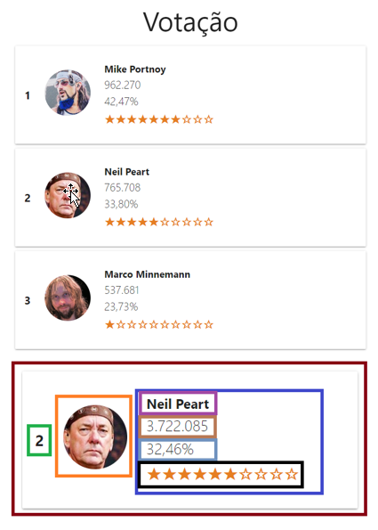

<h1 align="center">
  
</h1>

<p align="center">
  <a href="#-projeto">Projeto</a>&nbsp;&nbsp;&nbsp;|&nbsp;&nbsp;&nbsp;
  <a href="#-tecnologias">Tecnologias</a>
 </p>

<br>

## <p align="center"><b>DG02-M03-IGTI</b></p>

<br>

<p align="center">
  
</p>

<br>

## 💻 Projeto

O Desafio Guiado do Módulo 3 - Bootcamp FullStack IGTI (DG02-M03-IGTI) é um desafio no qual já é fornecido um projeto back-end que consiste num sistema de votação de três candidatos onde os atributos são: votos, percentual e popularidade, o objetivo desse desafio é fazer o front-end em React usando o máximo de Functional Components possível...para acessar o sistema de votação basta iniciar com o comando:

```bash
npm start
```

E acessar no navegador com:

```bash
http://localhost:8080/votes
```

<br>

## ✨ Tecnologias

Esse projeto foi desenvolvido com as seguintes tecnologias:

- HTML
- CSS
- JavaScript
- React

---
